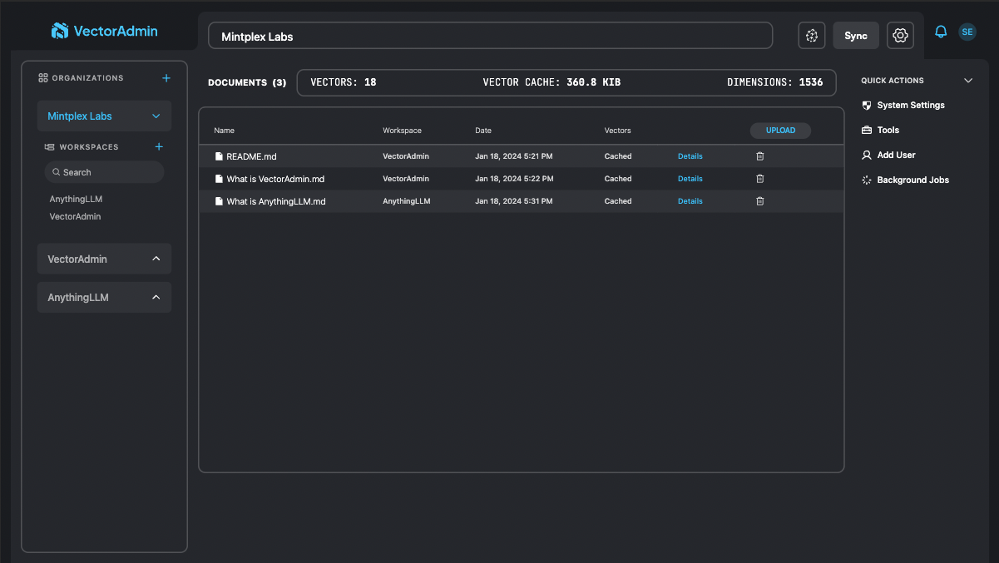

# VectorAdmin on Elestio with CI/CD

Deploy VectorAdmin server with CI/CD on Elestio

 
 

# Once deployed ...

You can open VectorAdmin here:

    URL: https://[CI_CD_DOMAIN]
    login: "admin"
    password: "[ADMIN_PASSWORD]"

You can open pgAdmin here:

    URL: "https://[CI_CD_DOMAIN]:12513"
    login: "[ADMIN_EMAIL]"
    password: "[ADMIN_PASSWORD]"
